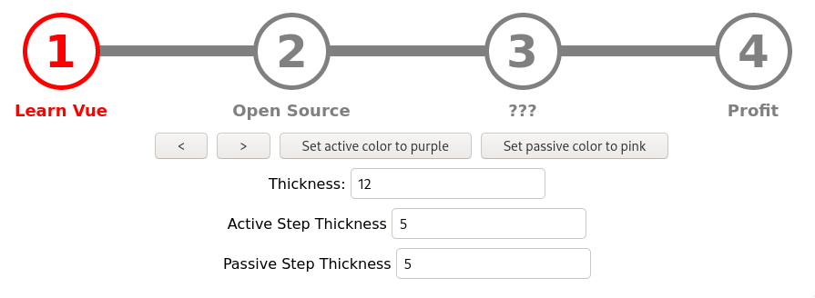

#   Vue Step Progress Bar

##  Demo


##  Installation

Install the plugin with npm:
```shell
npm install --save vue-step-progress
```

## Usage
⚠️ The default settings use Font Awesome for the checkmark icon. You can change the css icon class by using the
'icon-class' prop.

Add the Library import in the components you want to use the progress bar in:
```javascript
import StepProgress from 'vue-step-progress';

// import the css (OPTIONAL - you can provide your own design)
import 'vue-step-progress/dist/main.css';

// ...
// register the component in your Vue instance
  components: {
    'step-progress': StepProgress
  },
// ...
```

Put the `step-progress` element into your HTML where you want the Component to appear and pass the `steps` Array Prop
and the `current-step` Number prop.
```html
<div>
  <step-progress :steps="mySteps" :current-step="currentStep" icon-class="fa fa-check"></step-progress>
</div>
```

## Props

#### `steps`

A string array of all steps to be displayed. The Strings will be present as labels in the component. Example:

```javascript
['Step 1', 'Step 2', 'Step 3']
```

#### `current-step`

A simple Number prop that defines the index of the active step. Example:
```
2
```

#### `icon-class`

_Optional_

The css class of the checkmark icon. Default:
```
fa fa-check
```

#### `active-color`

_Optional_

A String prop that defines the active step color. It is red by default. Example:
```
blue
```

#### `passive-color`

_Optional_

A String prop that defines the passive step color. It is gray by default. Example:
```
black
```

#### `active-thickness`

_Optional_

A Number prop that defines the active step thickness. It is 5 by default. Example:
```
10
```

#### `passive-thickness`

_Optional_

A Number prop that defines the passive step thickness. It is 5 by default. Example:
```
10
```

#### `line-thickness`

_Optional_

A Number prop that defines the line thickness. It is 12 by default. Example:
```
10
```
## Development
To setup the local development environment it is recommended to use docker. *Note*: this will override your current
`npm` and `node` commands.
```bash
source source.sh
```
Install all development dependencies:
```bash
npm i
```

Start the development server
```bash
npm run dev
```

Build the dist files after changes
```bash
npm run build
```

Document your changes in the "Unreleased" section in `CHANGELOG.MD`.

## Publishing
Create a the `.npmrc` file:
```
//registry.npmjs.org/:_authToken=<token>
```

Run
```
npm publish
```
